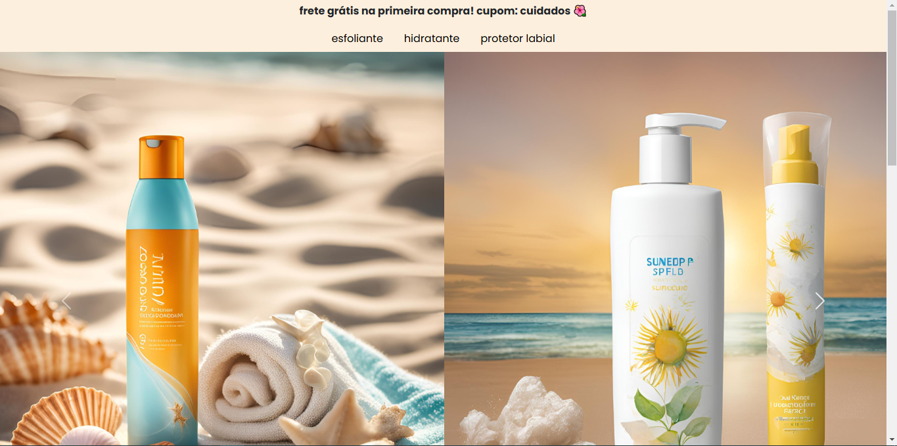

# Stunning Beauty

Stunning Beauty é um site simples de uma loja fictícia de cosméticos voltada para cuidados com a pele. O objetivo deste projeto é praticar HTML, CSS e Bootstrap, criando uma página funcional e responsiva.

---

## 📝 Funcionalidades

- Exibição de produtos como esfoliantes, hidratantes e protetores labiais.
- Navegação intuitiva com barra de menu.
- Design responsivo para dispositivos móveis e desktop.
- Promoção destacada com cupom de desconto.

---

## 🚀 Tecnologias Utilizadas

- **HTML5**: Estrutura do site.
- **CSS3**: Estilos personalizados.
- **Bootstrap 5**: Para responsividade.
- **Google Fonts**: Para tipografia moderna.

## Captura de tela

📖 Aprendizados
Este projeto me permitiu praticar:

Criação de layouts responsivos com Flexbox e Bootstrap.
Organização de pastas e estrutura de código.
Estilização com CSS para personalizar componentes.